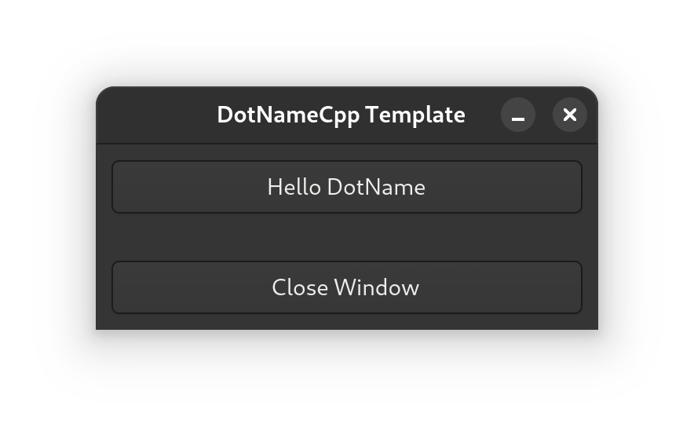

# HelloWorldGtkFree

Starter for creating a GTK4 application with a window and two buttons with integrated event handling. It uses Gtkmm, the official C++ interface for the popular GTK GUI library.

# Reusability in another projects

This project is a library accompanied by an executable file. You can use the library in your own project.

[CMake compatible (CPM.cmake, FetchContent, or add_subdirectory).](https://github.com/tomasmark79/DotNameCppFree?tab=readme-ov-file#reusability-in-another-projects)

## Standalone Example

## Standalone Usage
## References

 - [gtkmm4](https://gtkmm.gnome.org/en/index.html)
 - [gtkmm4 Dev Index](https://gnome.pages.gitlab.gnome.org/gtkmm-documentation/index.html)

---

**[DotName C++ Template](https://github.com/tomasmark79/DotNameCppFree)** – A practical and efficient template for modern C++ development. 🏗️ With pre-configured build settings, modular architecture, and broad platform compatibility, it helps you focus on writing great code. 🌈

## License

MIT License  
Copyright (c) 2024-2025 Tomáš Mark